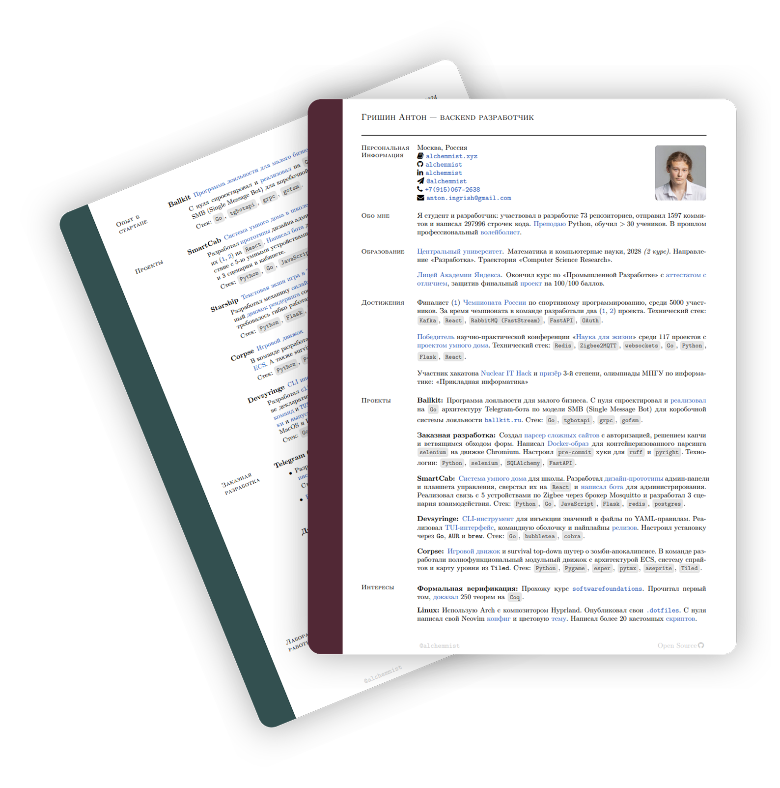

<h2> Resume (CV)</h2>

[](https://github.com/alchemmist/CV)
 


[](https://github.com/alchemmist/CV/actions/workflows/build.yaml)

This is my Curriculum Vita (CV) as a software engineer. I have two versions of CV ([english](/pdf/english.pdf) and [russian](/pdf/russian.pdf)) already rednered in [`pdf`](/pdf) directory. This repo have MIT license, so you can use it as a template for your CV or or whatever you want.

The `resome.cls` file it's a class of docuement (like _article_ or _book_ etc.) where define base document structure and visual view. I need to set it in a begining of CV tex file. This is a base header:

```tex
\documentclass[margin,line]{resume}

\usepackage[utf8]{inputenc}
\usepackage[english,russian]{babel}
\usepackage[T1]{fontenc}
\usepackage{fontawesome}

\usepackage[absolute]{textpos}
\usepackage{enumitem}

\usepackage{graphicx,wrapfig}
\usepackage{url}
\usepackage[colorlinks=true, pdfstartview=FitV, linkcolor=blue,
citecolor=blue, urlcolor=blue]{hyperref}
\pdfcompresslevel=9

\begin{document}
...
\end{document}
```

### Yandex internship resume

[Short Russian resume focused on my Yandex internship](pdf/short-yandex.pdf) · [LaTeX source](tex/short-yandex.tex). Uses the short resume layout with a `#fc3e1c` accent stripe.

### Blog icon

Use `\faAlcehmmist` for the blog logo, sized to the current text and vertically
centered with lowercase text:

```tex
\faAlcehmmist\space
\href{https://alchemmist.xyz}{\texttt{alchemmist.xyz}}
```

### Sidebar logos

Declare a comma-separated list of image paths in the preamble, after
`\documentclass`, to stack logos in the colored sidebar:

```tex
\sidebarlogos{../images/yandex-mark.pdf, ../images/another-logo.png}
```

The first logo sits at the bottom; subsequent logos stack upward with a 3 mm
gap. Logos are centered within the visible stripe, start 6 mm above the page
edge, and fit within the stripe (2 mm horizontal padding) and a 14 mm height
while preserving their aspect ratios. The stack repeats on every page.
Omit the command or use `\sidebarlogos{}` for no logos; calling it again replaces
the list. Paths are relative to the LaTeX build directory (`tex/` here).
PDF, PNG, and JPEG work with the existing pdfLaTeX build.

The class adds no borders, shadows, backgrounds, or cropping. Decoration and
transparent padding already present in an image remain part of that image.
Use an asset with a transparent background for a bare logo. The included
`yandex-mark.pdf` contains only the white mark from the
[Wikimedia Yandex icon](https://commons.wikimedia.org/wiki/File:Yandex_icon.svg),
without its circular background; its vector source is `images/yandex-mark.svg`.

### Building

You can build it with make:

```sh
brew install texlive
make build
```

After that in `pdf` directory wil be build a pdf version of all `.tex` files in repo.

### Questions | Contribute

If you have questions about this repo or you want to contribute, [text me](https://t.me/alchemmist)!

### Demo



### License

Licensed under of The [MIT](./LICENSE) License.

### Thanks for review

- Anatoly Zinoviev
- Alexander Shakhov
- Natalia Kuznetsova
- Mikhail Doshevsky
- Yegor Bugayenko
- Nikita Sobolev
- Maxim Smirnov
- Grigory Petrov
- Pavel Sokolov
- Mikhail Flenov
- Julia Lukyanova
- Ruslan Masgutov
- Alexey Goloburdin
- Mark Melixetyan
- Kristina Lozbina
- Ksenia Vdovkina

If you find your name here and you **don't want** for put your name here, text me on email: [`anton.ingrish@gmail.com`](mailto:anton.ingrish@gmail.com). If you belive I make a typo in your name, sorry for that and report it in issue.
