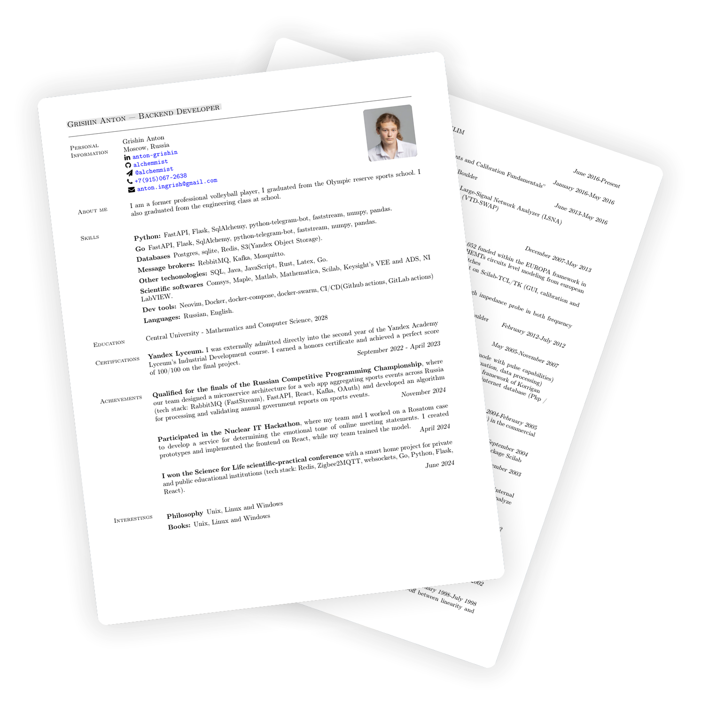

<h2> Resume (CV)</h2>


[](https://github.com/alchemmist/CV/actions/workflows/build.yaml)

This is my Curriculum Vita (CV) as a software engineer. I have two versions of CV ([english](/pdf/english.pdf) and [russian](/pdf/russian.pdf)) already rednered in [`pdf`](/pdf) directory. This repo have MIT license, so you can use it as a template for your CV or or whatever you want.

The `resome.cls` file it's a class of docuement (like _article_ or _book_ etc.) where define base document structure and visual view. I need to set it in a begining of CV tex file. This is a base header:

```tex
\documentclass[margin,line]{resume}

\usepackage[utf8]{inputenc}
\usepackage[english,russian]{babel}
\usepackage[T1]{fontenc}
\usepackage{fontawesome}

\usepackage[absolute]{textpos}
\usepackage{enumitem}

\usepackage{graphicx,wrapfig}
\usepackage{url}
\usepackage[colorlinks=true, pdfstartview=FitV, linkcolor=blue,
citecolor=blue, urlcolor=blue]{hyperref}
\pdfcompresslevel=9

\begin{document}
...
\end{document}
```

### Building

You can build it with make:

```sh
make build
```

After that in `pdf` directory wil be build a pdf version of all `.tex` files in repo.

### Questions | Contribute

If you have questions about this repo or you want to contribute, [text me](https://t.me/alchemmist)!

### Demo


